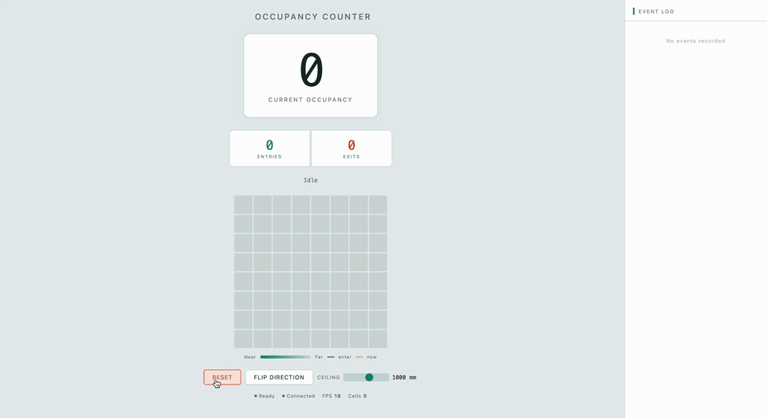
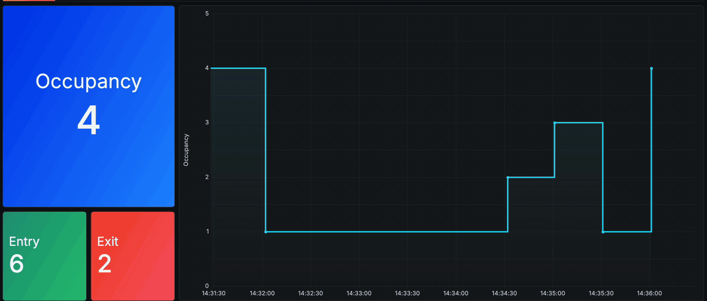

# Occupancy Counter — VL53L5CX + ESP32-C6

Real-time room occupancy tracking using a time-of-flight sensor, with cloud logging to Google Sheets and a live Grafana dashboard.

<p align="center">
  
</p>

A VL53L5CX 8×8 multizone ToF sensor points straight down from above a doorway. At 15 Hz it produces a grid of distance readings. When someone walks through, their head and shoulders appear as a cluster of cells closer than the learned baseline. The firmware detects those clusters, tracks them across the sensor's field of view, and based on the direction of travel classifies each crossing as an **entry** or **exit**.

The ESP32-C6 connects to WiFi (WPA2-Enterprise/eduroam by default, with a WPA2-PSK option for testing), logs snapshots to a Google Sheet, and optionally writes daily CSV files to a micro SD card. Uploads only happen when the doorway is clear so the tracking pipeline is never interrupted by network I/O. A Grafana Cloud dashboard reads the Sheet and displays live occupancy, entries, exits, and occupancy-over-time. The device deep-sleeps outside configurable hours and restores its calibration baseline from flash on wake.

---

## Hardware

| Component | Role |
|---|---|
| **VL53L5CX** (Pololu carrier board) | 8×8 multizone time-of-flight sensor, up to 4 m range |
| **ESP32-C6** | WiFi-capable RISC-V microcontroller running the firmware |
| **Micro SD breakout module** | Optional local CSV logging (SPI) |
| **Momentary push button** on GPIO3 | Hold 2 s to reset counts and clear saved baseline |

### Wiring

**Sensor (I2C):** `VIN→3V3` · `GND→GND` · `SDA→GPIO6` · `SCL→GPIO7` · `LPn→3V3` · `INT→GPIO5`

**SD card (SPI):** `CS→GPIO1` · `SCK→GPIO18` · `MOSI→GPIO19` · `MISO→GPIO20`

**Reset button:** `GPIO3→GND` (uses internal pull-up)

---

## Getting Started

### Prerequisites

- **Arduino IDE** or **arduino-cli** with the **ESP32** board package (≥ 3.x)
- Board selection: **ESP32C6 Dev Module**
- **USB CDC On Boot** must be **Enabled** in board settings for serial output

### Libraries

| Library | Purpose |
|---|---|
| [SparkFun VL53L5CX](https://github.com/sparkfun/SparkFun_VL53L5CX_Arduino_Library) | Sensor driver |
| [ESP-Google-Sheet-Client](https://github.com/mobizt/ESP-Google-Sheet-Client) | Google Sheets API with service-account auth |
| [ESP32WiFiEnterprise](https://github.com/racoonx65/WiFiEnterprise) | WPA2-Enterprise (eduroam) support |

### Setup

1. Clone this repo
2. Copy `secrets_template.h` → `secrets.h`
3. Fill in your eduroam credentials, GCP service account, and Spreadsheet ID
4. (Optional) To use a home WiFi network instead of eduroam, uncomment `USE_HOME_WIFI` and set `HOME_SSID` / `HOME_PASSWORD` in `secrets.h`
5. Flash to ESP32-C6
6. Keep the doorway clear for ~2 seconds while the sensor calibrates

### Google Sheets

Create a Google Sheet with a tab named **Data**. Share it with your GCP service account email (Editor). The firmware appends rows starting at `Data!A2`:

| Column A | Column B | Column C | Column D | Column E |
|---|---|---|---|---|
| EpochTimestamp | Occupancy Count | Entry | Exit | Time (EST) |

### Grafana Dashboard

1. Install the **Google Sheets** data source plugin in Grafana Cloud
2. Configure with your API key and Spreadsheet ID
3. Import `grafana-dashboard.json`
4. The chart panel needs two transformations: convert `EpochTimestamp` to Time (format `X`), convert `Occupancy Count` to Number

| Panel | Type | Color |
|---|---|---|
| Occupancy | Stat (big number) | `#3A82FF` blue |
| Entries | Stat | `#34D399` mint |
| Exits | Stat | `#F87171` coral |
| Occupancy Over Time | Time series | `#22D3EE` cyan |

<p align="center">
  
</p>

---

## How It Works

### Detection & Tracking Pipeline

Each frame at ~15 Hz runs through this pipeline:

1. **Validate** — accept cells with `target_status` 5, 6, or 9 (per VL53L5CX datasheet UM2884) and distance > 0
2. **Min-distance filter** — rolling minimum over the last 3 frames per cell, reducing multipath noise (UM2600 §6.2)
3. **Occupied mask** — a cell is occupied if its filtered distance is above `DETECT_FLOOR_MM` (100 mm), below `DETECT_CEILING_MM` (1000 mm), and after calibration at least `STATIC_MARGIN_MM` (100 mm) shorter than its baseline
4. **BFS blob detection** — flood-fill finds connected clusters of occupied cells; blobs smaller than `MIN_BLOB_SIZE` (2 cells) are discarded
5. **Greedy association** — each blob is matched to its nearest existing track by centroid distance (within 3.0 grid cells)
6. **Track expiry** — unmatched tracks accumulate misses; after a grace period (5 frames) or total timeout (90 frames), the track is evaluated
7. **Spawn** — unmatched blobs become new tracks
8. **Direction evaluation** — `shift = last_row − enter_row`; if the shift exceeds 1.5 rows and the track lived for ≥3 frames, the direction relative to `ENTRY_DIR` determines entry vs exit; occupancy is incremented or decremented accordingly

### Idle-Only Uploads

Google Sheets uploads and SD card writes only occur when `tracking_active` is false (no one in the doorway). This prevents blocking HTTPS calls from stalling the tracking pipeline and causing missed frames or false counts. Data is buffered and sent the moment the doorway clears.

### Calibration & Baseline Persistence

On first boot the sensor averages 30 frames (~2 s) of the empty doorway to learn a per-cell baseline. This baseline is saved to ESP32 NVS flash. On subsequent boots (including wake from deep sleep) the baseline is restored automatically — no recalibration delay.

Holding the reset button for 2 seconds clears the saved baseline, resets all counters, and starts a 10-second countdown so you can clear the doorway before calibration begins.

### Sleep Schedule

When `SLEEP_ENABLED` is set (default), the device:
- Checks the clock every 30 seconds
- At 21:30 (configurable): resets counts, uploads a final row, saves baseline to flash, stops the sensor, unmounts the SD card, turns off WiFi, and enters deep sleep
- At 06:30 (configurable): wakes via timer, reboots, reconnects, restores baseline, and starts tracking with fresh counters
- If it boots outside the active window, it immediately sleeps until the next wake time
- Each sleep is capped at 1 hour for timer reliability; `setup()` re-evaluates on each wake

### SD Card Logging

When `SD_ENABLED` is set (default), a CSV row is written to `/YYYY-MM-DD.csv` on the SD card every 5 minutes (configurable via `SD_LOG_INTERVAL_MS`), independent of the Sheets upload interval. Like Sheets uploads, SD writes only occur when the doorway is clear.

---

## Project Structure

```
OccupancyCounter/
├── OccupancyCounter.ino      Main sketch (setup, loop, WiFi, Sheets, SD, sleep)
├── config.h                   All tuneable constants
├── tracking.h                 OccupancyTracker class (algorithm + NVS persistence)
├── secrets_template.h         Credential placeholders — copy to secrets.h
├── grafana-dashboard.json     Importable Grafana dashboard
├── .gitignore                 Excludes secrets.h
└── README.md                  This file
```

---

## Configuration Reference

All compile-time constants are in `config.h`.

### Pins

| Constant | Value | Purpose |
|---|---|---|
| `SDA_PIN` | 6 | I2C data |
| `SCL_PIN` | 7 | I2C clock |
| `INT_PIN` | 5 | Sensor interrupt (active LOW) |
| `RESET_BUTTON_PIN` | 3 | Reset button (active LOW, internal pull-up) |
| `SD_CS_PIN` | 1 | SD chip select |
| `SD_CLK_PIN` | 18 | SD clock |
| `SD_MOSI_PIN` | 19 | SD MOSI |
| `SD_MISO_PIN` | 20 | SD MISO |

### Sensor & Detection

| Constant | Value | Purpose |
|---|---|---|
| `SENSOR_FREQ_HZ` | 15 | Ranging frequency (Hz) |
| `DETECT_FLOOR_MM` | 100 | Ignore closer than this (near-field noise) |
| `DETECT_CEILING_MM` | 1000 | Detection ceiling (mm below sensor) |
| `STATIC_MARGIN_MM` | 100 | Min baseline–reading delta to count as occupied |

### Tracking

| Constant | Value | Purpose |
|---|---|---|
| `MAX_BLOBS` / `MAX_TRACKS` | 4 | Simultaneous blob/track limit |
| `MIN_BLOB_SIZE` | 2 | Min cells for a valid blob |
| `MAX_ASSOC_DIST` | 3.0 | Max centroid distance for track↔blob match |
| `MIN_CROSSING_FRAMES` | 3 | Min frames for a real crossing (~200 ms) |
| `MAX_CROSSING_FRAMES` | 90 | Timeout for lingering track (~6 s) |
| `MIN_CENTROID_SHIFT` | 1.5 | Min row shift to count as a crossing |
| `MISS_GRACE_FRAMES` | 5 | Frames to tolerate dropout (~333 ms) |
| `ENTRY_DIR` | -1 | Row direction that counts as entry |
| `MIN_FILTER_DEPTH` | 3 | Rolling min-filter window (frames) |

### Calibration

| Constant | Value | Purpose |
|---|---|---|
| `CALIB_FRAMES` | 30 | Frames to average for baseline (~2 s) |
| `CALIB_MAX_DIST_MM` | 4000 | Default baseline for cells with no valid readings |

### Sleep Schedule

| Constant | Value | Purpose |
|---|---|---|
| `SLEEP_ENABLED` | 1 | Set to 0 to run 24/7 |
| `SLEEP_HOUR` / `SLEEP_MINUTE` | 21 / 30 | Sleep at 9:30 PM |
| `WAKE_HOUR` / `WAKE_MINUTE` | 6 / 30 | Wake at 6:30 AM |
| `SLEEP_CHECK_INTERVAL_MS` | 30000 | Clock check interval |

### Networking & Logging

| Constant | Value | Purpose |
|---|---|---|
| `SHEETS_UPLOAD_INTERVAL_MS` | 30000 | Sheets upload every 30 s (when idle) |
| `SD_LOG_INTERVAL_MS` | 300000 | SD backup every 5 min (when idle) |
| `WIFI_CHECK_INTERVAL_MS` | 5000 | WiFi health check interval |
| `MAX_RECONNECT_ATTEMPTS` | 5 | Reconnect cap per boot |
| `NTP_SERVER` | `pool.ntp.org` | Time server |
| `TZ_INFO` | `EST5EDT,...` | POSIX timezone (Eastern + DST) |
| `SD_ENABLED` | 1 | Set to 0 to disable SD logging |

---

## Serial Monitor Reference

| Tag | Meaning | Example |
|---|---|---|
| `[INIT]` | Sensor init | `[INIT] 8x8 @ 15 Hz, INT on GPIO5` |
| `[WIFI]` | WiFi status | `[WIFI] Connected — IP 10.0.0.50  RSSI -45 dBm` |
| `[TIME]` | NTP sync | `[TIME] NTP configured` |
| `[AUTH]` | Sheets token | `[AUTH] OAuth2.0 access token — ready` |
| `[CAL]` | Calibration | `[CAL] Baseline restored from flash — skipping calibration` |
| `[RUN]` | Tracking active | `[RUN] Active — ceiling 1000 mm, shift 1.5 rows, max 4 tracks` |
| `[SHEET]` | Upload result | `[SHEET] OK — occ:1  in:3  out:2  heap:177536` |
| `[SD]` | SD card | `[SD] Card mounted — 7640MB` |
| `[SLEEP]` | Sleep events | `[SLEEP] 21:30 — time to sleep` |
| `[BTN]` | Button reset | `[BTN] Reset — clear the doorway!` |

---

## Daily Lifecycle

1. **06:30** — ESP32 wakes from deep sleep, reboots
2. WiFi connects, NTP syncs, Google Sheets authenticates, SD card mounts
3. Baseline restored from flash — tracking starts immediately
4. Counts begin at zero for the new day
5. Occupancy logged to Sheet every 30 s and SD every 5 min (only when doorway is clear); Grafana auto-refreshes
6. **21:30** — counts reset, final upload, baseline saved, sensor stopped, SD unmounted, WiFi off, deep sleep
7. Repeat

---

## References

- [VL53L5CX Datasheet (UM2884)](https://www.st.com/resource/en/user_manual/um2884-a-guide-to-using-the-vl53l5cx-multizone-timeofflight-ranging-sensor-with-wide-field-of-view-ultra-lite-driver-uld-stmicroelectronics.pdf) — target_status codes, resolution modes
- [VL53L5CX Ranging Guide (AN5765)](https://www.st.com/resource/en/application_note/an5765-vl53l5cx-ranging-module-user-guide-stmicroelectronics.pdf) — ranging modes, target-order, sigma/signal thresholds
- [People-Counting App Note (UM2600)](https://www.st.com/resource/en/user_manual/um2600-counting-people-with-the-vl53l1x-longdistance-ranging-timeofflight-sensor-stmicroelectronics.pdf) — min-distance filter (§6.2); originally for VL53L1X, technique adapted here
- [SparkFun VL53L5CX Library](https://github.com/sparkfun/SparkFun_VL53L5CX_Arduino_Library)
- [ESP-Google-Sheet-Client](https://github.com/mobizt/ESP-Google-Sheet-Client)
- [ESP32WiFiEnterprise](https://github.com/racoonx65/WiFiEnterprise)
